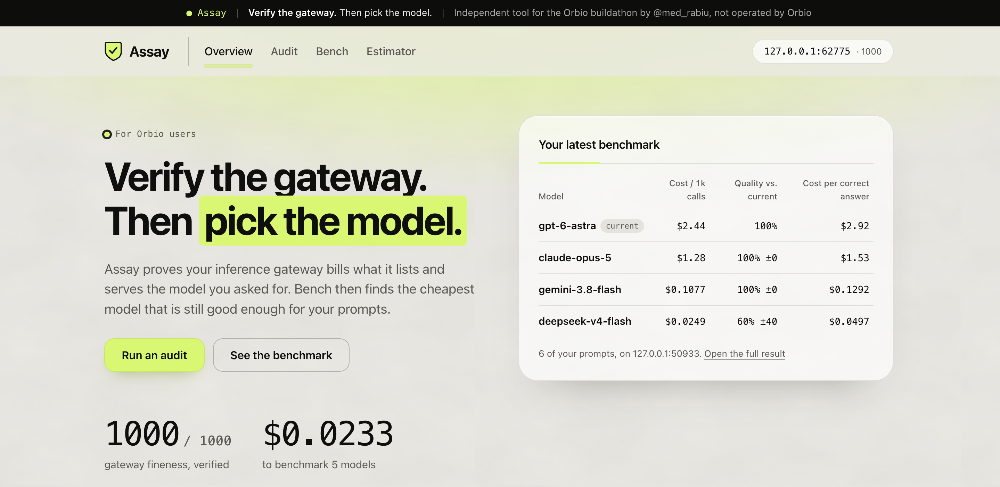
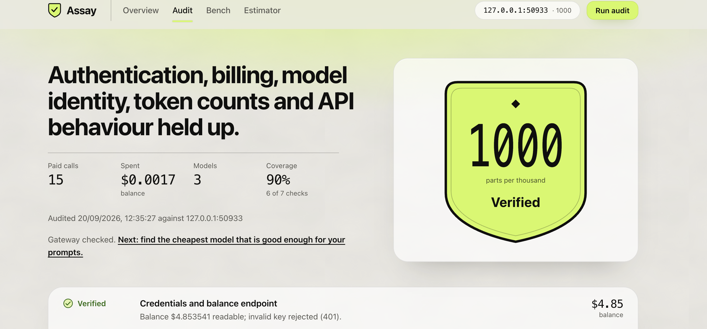
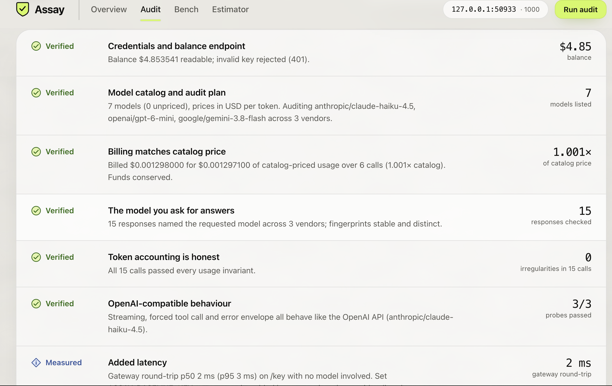
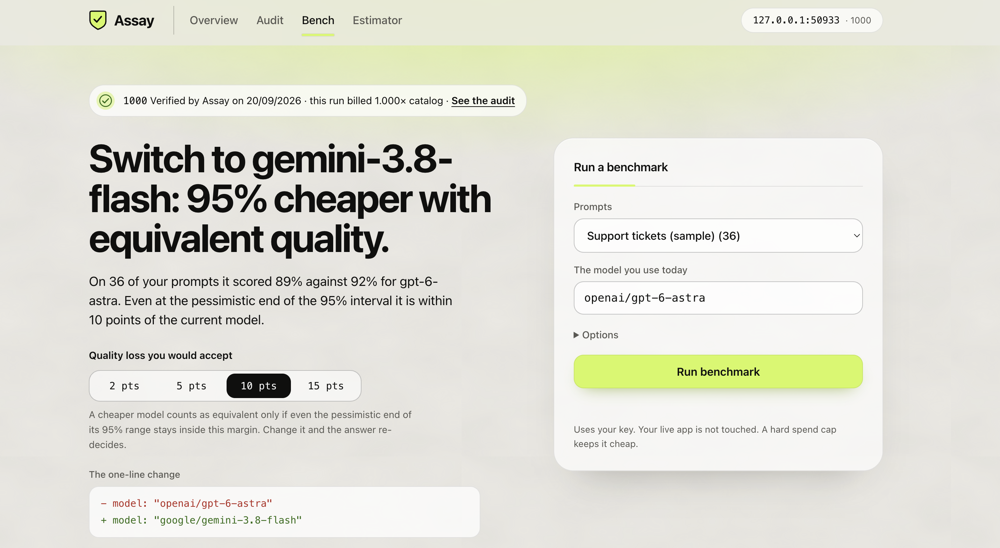
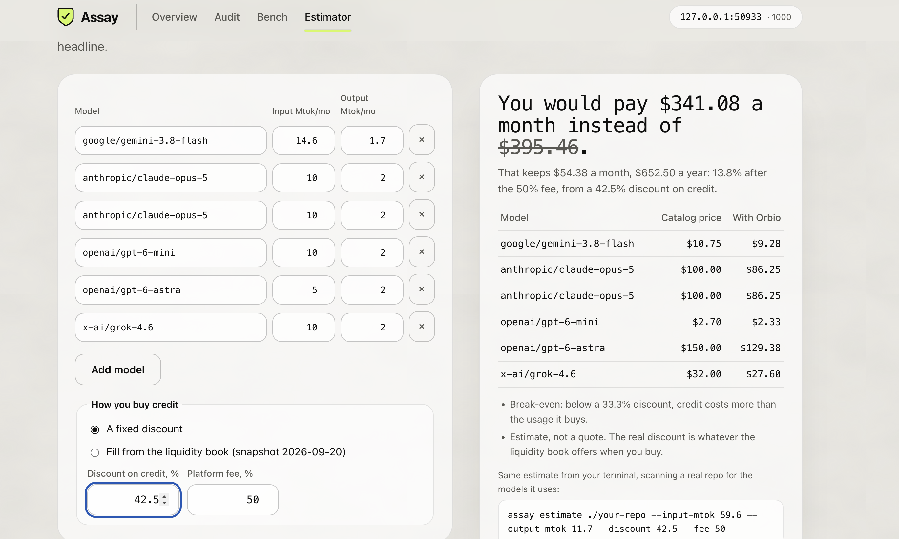

# Assay

**Verify the gateway. Then pick the model.**



Assay is two tools in one dashboard, for people buying inference through the [Orbio](https://orbio.so) gateway.

|  | What it answers | How |
| --- | --- | --- |
| **Audit** | *Can I trust this gateway?* | With your own key it checks billing, model identity, token counts and API behaviour, and scores the result out of 1000. |
| **Bench** | *Which model should I use?* | Replays **your own prompts** on cheaper models through the same key, grades every answer, and recommends a switch only when the evidence supports it. |

They live together because a benchmark run through a gateway you have not verified measures nothing.
Every benchmark carries the latest audit score and reconciles its own billing.

- **Zero dependencies.** Node ≥ 20.12, built-ins only. Nothing to audit but this code.
- **Cheap by construction.** Hard spend caps: $0.25 for an audit, $1.00 for a benchmark (`--max-spend`).
- **Honest.** Every verdict shows its raw numbers, every check says what it cannot prove, and Bench never recommends a switch on a point estimate.

## Contents

[Try it in a minute](#try-it-in-a-minute) · [Run it on your gateway](#run-it-on-your-gateway) · [Audit](#audit) · [Bench](#bench) · [Estimator](#estimator) · [Commands](#commands) · [Security](#security) · [Testing](#testing) · [Layout](#layout) · [Limits](#limits)

## Try it in a minute

No key, no network, no cost. A built-in fake gateway stands in for Orbio.

```bash
git clone <this repo> && cd assay
node bin/assay.js demo --bench --serve      # verify a healthy gateway, then benchmark on it
node bin/assay.js demo --fault overcharge   # or watch the audit catch an overcharging gateway
```

Open the dashboard it prints. Change **Quality loss you would accept** on the Bench page: with the demo
data, 5 points says *"36 prompts cannot prove it"*, and 10 points says *"Switch to gemini-3.8-flash"*.
Other faults to try: `swap`, `inflate`, `lag`, `coarse`, `nostreamusage`, `notools`, `noauthcheck`.

## Run it on your gateway

```bash
cp .env.example .env            # put your Orbio key in ORBIO_API_KEY
node bin/assay.js probe         # 1. confirm Assay reads your gateway's API shapes
node bin/assay.js run           # 2. audit it
node bin/assay.js bench --sample --current <a model you use> --dry-run   # 3. plan and cost, no benchmark yet
node bin/assay.js bench --sample --current <a model you use>             # 4. benchmark
node bin/assay.js serve         # 5. dashboard at http://localhost:4477
node bin/assay.js export --public   # 6. one self-contained scorecard.html to share
```

Before you start:

1. **Use a dedicated key.** Billing is checked by reading your balance, so other clients spending on the same key during the run look like overcharging.
2. **Run `probe` first.** It prints redacted raw shapes for `/key`, `/models`, a chat call, a stream and the balance afterwards. If a check misreads your gateway, this is what to look at.
3. **Start Bench small.** Use `--dry-run`, then `--limit 20`, and check its billing line says *reconciled*.
4. **Optional:** set `ASSAY_BASELINE_KEY` (a direct OpenRouter key) to turn the latency line from *measured* into a real verdict and to compare tokenizer fingerprints against the provider directly.

Settings live in `.env` (see `.env.example`): `ORBIO_API_KEY`, `ORBIO_BASE_URL` (default
`https://api.orbio.so/api/v1`), `ASSAY_MAX_SPEND_USD`, `ASSAY_MODELS`, `ASSAY_DIR`. The key is never
accepted as a command-line flag, so it stays out of your shell history.

## Audit



The agent reads your balance and the model catalog, picks the cheapest viable model from several
vendors, proves each one can answer, spends a few cents on fixed public prompts, and compares what the
gateway *says* with what your balance *does*. Anything suspicious is re-run on a larger sample before it
counts as a failure.

| Check | Weight | Claim | How |
| --- | -: | --- | --- |
| `billing` | 30 | Billed ≤ catalog price | Balance before → canary calls → wait for charges to land → compare the drop with Σ(tokens × price) in exact BigInt decimals. |
| `identity` | 20 | The requested model answered | Returned model name, unique response ids, and a **tokenizer fingerprint** that is stable per model and distinct across vendors. |
| `tokens` | 15 | Usage counts are honest | Invariants on every response: completion ≤ `max_tokens`, total = prompt + completion, plausible prompt tokens, stable across repeats. |
| `compat` | 15 | Behaves like the OpenAI API | SSE streaming with usage, a forced tool call with valid JSON arguments, the error envelope for an unknown model. |
| `latency` | 10 | < 50 ms added | With a baseline key: interleaved A/B against the provider with a bootstrap CI. Without one it reports the round trip only and says it cannot isolate overhead. |
| `auth` | 5 | Credentials enforced | An invalid key must get 401/403. |
| `catalog` | 5 | Catalog is sane | Unique ids, finite non-negative prices, price-unit detection, and a preflight call to every audit model. |



**Fineness** = `1000 × Σ(weight × points) / Σ(weight)` over the checks that ran (pass 1, warn ½, fail 0).
A failure in `billing`, `tokens`, `identity` or `auth` caps the score at 600. **Coverage** is always shown,
and the top grade is withheld below 80%, so a clean result on thin evidence never looks strong.

Extras: `assay watch --every 30m --alert-below 900 --webhook <url>` repeats the audit and alerts on
regression. `--narrate` has a cheap model write a plain-English summary, which is **discarded if it
contains any number not present in the evidence**.

## Bench



Most teams choose one model and never revisit it. Bench automates the comparison:

1. **Capture.** A JSONL file of your real prompts, each with a check that defines a correct answer.
2. **Shadow-run.** The same prompts go to your current model and several cheaper ones through one key. Your live app is never touched.
3. **Score.** Deterministic checks where an answer is checkable. For fuzzy answers, a **judge model** compares each candidate with your current model twice, **with the order swapped**, and is never from the same vendor as either.
4. **Report.** Cost per 1k calls, quality against your current model with a 95% range, and **cost per correct answer**, which stops a cheap-but-wrong model from looking like a bargain.

```
  gemini-3.8-flash looks promising, but 36 prompts cannot prove it.

  model               cost / 1k calls   quality vs. current   cost / 1k correct   verdict
  ● gpt-6-astra                 $2.47                  100%               $2.70   current
  ► gemini-3.8-flash          $0.1171                 97% ±5             $0.1317   inconclusive
```

**The decision rule is deliberately conservative.** A cheaper model counts as equivalent only when the
*lower* end of a 95% paired-bootstrap interval on (candidate − current) accuracy stays inside your
margin (default 5 points). Otherwise Bench says how many more prompts would settle it. In the dashboard
the margin is a control and the answer re-decides live, so the recommendation is visibly a function of how
much quality loss *you* accept.

### Your prompts

`examples/support-tickets.jsonl` is a 36-prompt sample. Use your own with `--data prompts.jsonl`:

```jsonl
{"id":"t1","system":"Reply with JSON only.","prompt":"Ticket: I was charged twice.","expect":{"fields":{"category":"billing"}}}
{"id":"r1","prompt":"Write a two-sentence reply to this angry customer…","expect":{"maxChars":600},"judge":{"rubric":"Polite, specific, promises a concrete next step"}}
```

Checks: `json`, `schema`, `fields`, `equals`, `contains`, `notContains`, `regex`, `maxChars`. A malformed
file reports every problem with line numbers before a cent is spent. On judged prompts your current model
is the reference: a candidate must be at least as good.

### Good to know

- **Every benchmark is also a billing audit.** It reconciles the whole run against your balance and reports the ratio to catalog price.
- Models that cannot answer a preflight call are skipped and listed, never silently benchmarked.
- Only prompts every model completed are compared, so hitting the spend cap leaves a fair, smaller result.
- `--no-samples` keeps answer excerpts out of the saved report, and `export --public` strips them.
- A benchmark is only as representative as your prompts. Include your hard cases.

## Estimator



Billing is metered at catalog rate. The discount is earned when you **buy** credit, and Orbio adds a 5% fee
on the discounted price, so the headline is not what you keep:

```
cash cost = usage × (1 − discount) × (1 + fee)      # 22.5% headline → 18.6% kept
```

```bash
assay estimate ./my-repo --input-mtok 40 --output-mtok 8 --discount 22.5
assay estimate ./my-repo --input-mtok 40 --output-mtok 8 --book     # blend from the liquidity book
```

It scans the repo for provider base URLs, model ids and env var names (**names only, never values; no
source lines are stored**), matches them to the live catalog, shows the two-line migration without
touching your files, and prices your volume. The dashboard has the same model as a calculator, including
the point where a small discount stops covering the fee (4.8%). Bench hands its measured token counts to
it. The liquidity-book tiers are a dated snapshot, and the result is an estimate, not a quote.

## Commands

```
assay run       [--models a,b] [--max-spend 0.25] [--narrate] [--fail-under N] [--json]
assay bench     --current <model> [--sample | --data file.jsonl] [--candidates auto|a,b] [--judge model]
                [--margin 5] [--limit N] [--max-spend 1.00] [--dry-run] [--no-samples] [--json]
assay serve     [--port 4477]
assay export    [--out scorecard.html] [--public]
assay watch     [--every 30m] [--alert-below 900] [--webhook URL]
assay estimate  [path] [--input-mtok N] [--output-mtok N] [--discount 22.5] [--fee 5] [--book] [--json]
assay probe
assay demo      [--bench] [--fault <name>] [--serve]
```

Exit codes: `0` ok · `1` below `--fail-under` (use it as a CI gate) · `2` usage or config · `3` runtime.

## Security

- The key comes from the environment only, is redacted before any log or stored error, and reports hold a sha-256 *fingerprint*, never the key.
- The dashboard binds to `127.0.0.1`, rejects foreign `Host` and `Origin` headers (DNS rebinding, cross-site spend), sends a strict CSP, and proxies the catalog so the key never reaches the browser. All dynamic text is set through DOM text nodes.
- `POST /api/bench/run` sits behind the same guards, requires `application/json`, caps the body at 4 KB, validates every field, and can only name datasets the server itself lists.
- Chat calls are never auto-retried: a retry could double-charge and corrupt the reconciliation.
- Audit prompts are fixed public text. Bench sends *your* prompts, to the gateway you chose, with your key. Nothing else leaves your machine.

## Testing

```bash
npm test        # 153 tests, ~50 s, no network, no key
```

Beyond unit tests for exact decimals, statistics, SSE parsing and each check, a **fault-injecting mock
gateway** (`src/mock/gateway.js`) proves the audit catches what it claims to: overcharging, model
substitution, token inflation, slow settlement, coarse balances, open auth, missing stream usage and ignored
`tool_choice`. A clean gateway must score 1000. The same mock simulates models of different skill, broken
models and a talkative model that trips the spend cap, so Bench's statistics, decision rule, judge
order-swapping and server security are tested directly. It is also what `assay demo` runs.

Live testing found real bugs, now pinned by regression tests: an audit that claimed three vendors when one
answered, billing that mistook a late charge for an overcharge, and a fix that then under-measured. The
write-up is in [`PRODUCT.md`](PRODUCT.md), section 6c.

## Layout

```
bin/assay.js          entry                    src/agent.js        the audit loop
src/cli.js            commands                 src/checks/*.js     one module per check
src/client.js         gateway client           src/bench/          Bench engine
src/decimal.js        BigInt fixed-point money src/server.js       dashboard API
src/estimate/         repo scanner             src/export.js       single-file scorecard
src/mock/             fault injection          web/                dashboard (HTML, CSS, ES modules)
examples/             sample prompts           public/img/         screenshots used in this README
web/pricing.js, web/recommend.js               shared by the CLI and the browser
```

## Limits

Assay cannot see whether prompts are stored, cannot prove which weights ran (it detects mislabelling and
gross substitution), and cannot isolate gateway latency without a baseline key. Bench only tells you how
models behave on the prompts you gave it, and an LLM judge has its own biases: Bench reports how often the
judge changed its pick when the order flipped. The dashboard's Method page says the same, on purpose.

## Community

- [Contributing](CONTRIBUTING.md): ground rules, setup and how to send a change
- [Code of Conduct](CODE_OF_CONDUCT.md): how we treat each other
- [Security policy](SECURITY.md): report vulnerabilities privately
- [Support](SUPPORT.md): where to ask for help
- [Changelog](CHANGELOG.md): what changed in each release

MIT licensed ([LICENSE](LICENSE)). Assay is an independent tool built for the Orbio agent hackathon and is not operated by Orbio.
